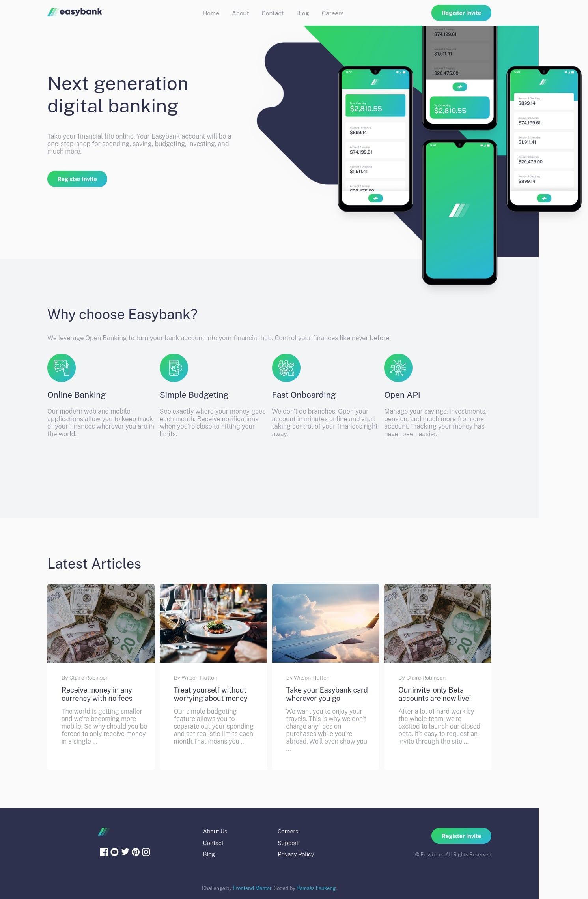

# Frontend Mentor - Easybank landing page solution

This is a solution to the [Easybank landing page challenge on Frontend Mentor](https://www.frontendmentor.io/challenges/easybank-landing-page-WaUhkoDN). Frontend Mentor challenges help you improve your coding skills by building realistic projects. 

## Table of contents

- [Overview](#overview)
  - [The challenge](#the-challenge)
  - [Screenshot](#screenshot)
  - [Links](#links)
- [My process](#my-process)
  - [Built with](#built-with)
  - [What I learned](#what-i-learned)
  - [Continued development](#continued-development)
- [Author](#author)

**Note: Delete this note and update the table of contents based on what sections you keep.**

## Overview

### The challenge

Users should be able to:

- View the optimal layout for the site depending on their device's screen size
- See hover states for all interactive elements on the page

### Screenshot




### Links

- Solution URL: [code source](https://github.com/ramzy05/01-FM-easybank-landing-page-master/tree/final)
- Live Site URL:[demo](https://01fem-project.netlify.app)

## My process

### Built with

- Semantic HTML5 markup
- CSS custom properties
- Flexbox
- CSS Grid
- Desktop-first workflow


### What I learned

```html
<h1>Some HTML code I'm proud of
  using grid and flexbox
</h1>
```
```css
.proud-of-this-css {
  This is was my first time to make site look responsive, I can't believe that I made 
  a mobile version of this site🎉
}
```

### Continued development

I have to continue working on projects which include css grids and flexbox


## Author

- Frontend Mentor - [@ramzy05](https://www.frontendmentor.io/profile/ramzy05)
- Twitter - [@ramzy0jr](https://www.twitter.com/ramzy0jr)


